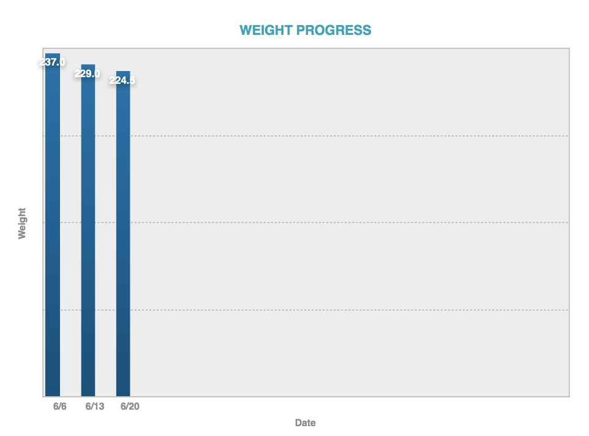



# What is this place?
---

I'm fat. Oh, and I'm really unhealthy. My body hurts, and I'm always dead tired. Sadly, because of this, I tend to avoid playing with my kids or really doing any kind of physical activity...which of course just compounds the problem. So something needs to change, and it needs to change now.

It turns out that an old friend of mine named Becky Reilly is a health coach with the [Take Shape For Life program](http://beckyreilly.tsfl.com/). Since I'm the kind of guy that really needs to be told exactly what to do with food if I have any hope of getting healthy, I've decided to commit to the plan.

I debated back and forth about whether to keep this whole thing private until I started reaching my goals or just tell as many people as possible in an effort to get that much more accountability. This site should tell you which way I've decided to go with it. I knew I wanted to do a blog or keep a journal, but then this idea hit me...I'll open-source my journey toward better living. What I want to try out is to open this up to external contributions such as menu ideas, meal ideas, and whatever else seems appropriate. This is my first time using GitHub Pages, so it may take a while to figure out how to do a few things. I plan to just blog whenever the feeling strikes me as well as post periodic updates with measurements and photos.

# Weight Chart
---



# Recent posts
---





